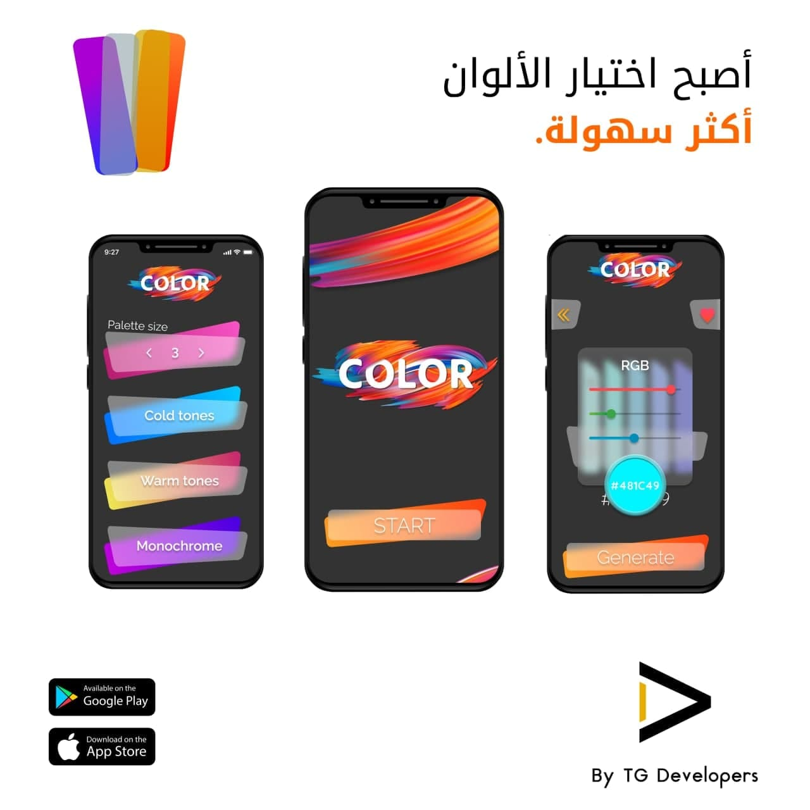
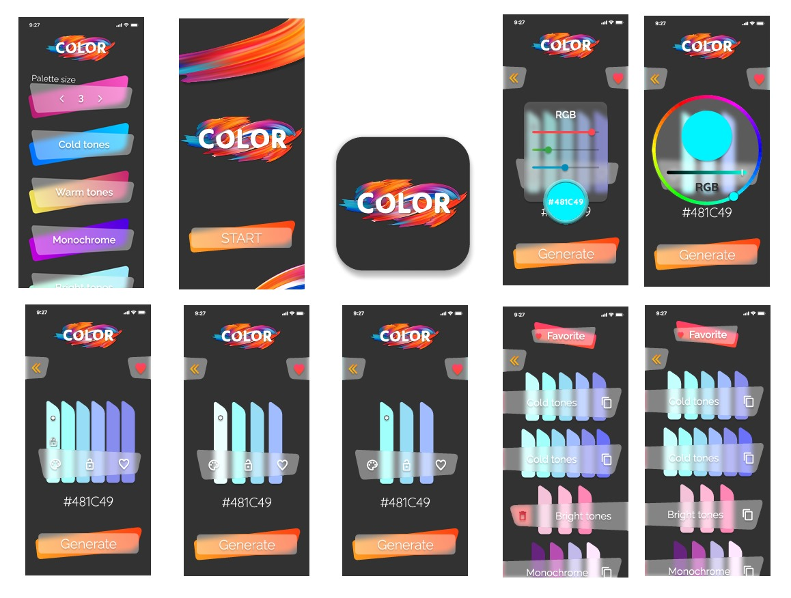
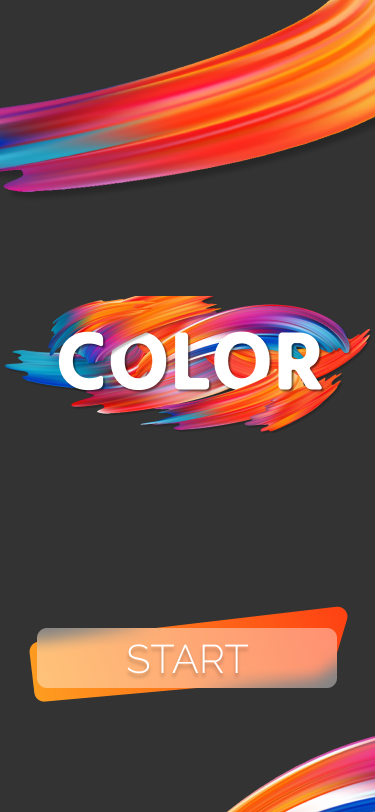
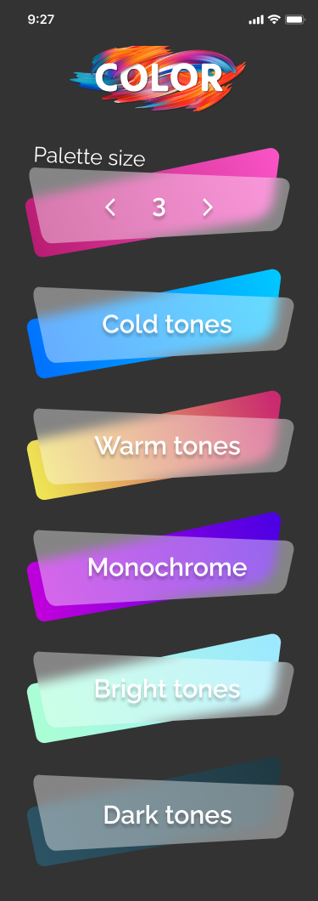
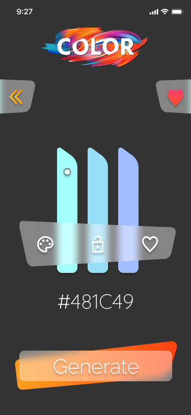
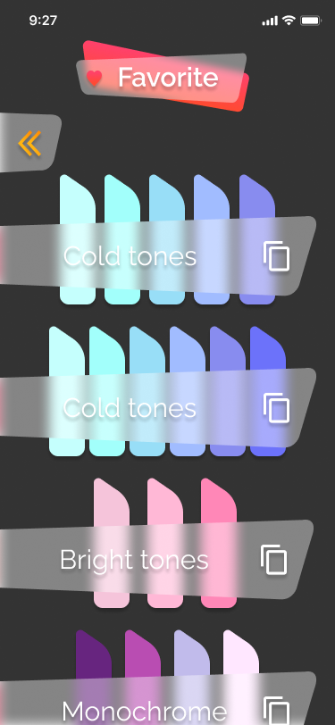

# 🎨 Flutter Color Palette Generator

> تطبيق تجريبي بسيط لتوليد ألوان متناسقة باستخدام Flutter

  

---

## 📱 فكرة التطبيق

تطبيق يساعدك في إنشاء مجموعات ألوان متناسقة حسب عدد الألوان ونوع التناسق الذي تريده، مثل:

- Cold Tones ❄️  
- Warm Tones 🔥  
- Monochrome 🎭  
- Bright Tones 🌈  
- Dark Tones 🌑

⚙️ **مميزات التطبيق:**

- اختيار عدد الألوان: 3 أو 6 ألوان
- إمكانية إعادة توليد جزء من الألوان مع تثبيت الألوان اللي عجبتك
- تعديل كل لون يدويًا
- حفظ الألوان المفضلة ومشاهدتها لاحقًا
- إمكانية حذف الألوان من المفضلة

---

## 🧠 ما تعلمته من هذا المشروع

- تحسين استخدامي لـ Flutter Widgets في التصميم
- التعامل مع حالات الاستخدام الحقيقية للمستخدم
- تطبيق مفهوم الـ State Management بطريقة مرنة
- التفكير في تجربة المستخدم (UX) وواجهة الاستخدام (UI)

---

## 🛠️ التقنيات المستخدمة

- Flutter
- Dart
- CustomPainter (لرسم بعض العناصر)
- setState لإدارة الحالة
- SharedPreferences (لحفظ الألوان المفضلة)

---

## 🗓️ مدة المشروع

⏳ يناير 2022 – مارس 2022

---

## 📸 صور من التطبيق

  
  
<!--    -->
  
  

---

## ❗ ملاحظة

تم فقدان الكود بسبب مشكلة في الجهاز، لكن الصور توضح التصميم والمميزات التي تم تنفيذها بالكامل.

---

## 👋 تواصل معي

هل عندك أي سؤال؟ تقدر تتواصل معايا على [LinkedIn](https://www.linkedin.com/in/ansbedoor)
